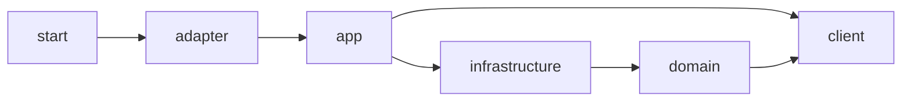

# 标准多模块架构

## 基线与规则来源

**COLA 规则（限定 Web 模板）**：研究基线、原始文件和差异在 [sources.md](sources.md)。只支持标准 Web 多模块方案；识别其他变体时说明覆盖范围，保留其已有结构。示例技术版本是独立适配结果，不能将旧模板构建文件直接当作 Java 21 / Boot 3 模板。

这是 Web 模板的**显式项目模块编译依赖**。第三方依赖与测试依赖另查 POM；传递可见不意味着职责上允许随意调用。craftsman 的 Domain 没有相同的 Client 依赖，不可把两个项目的模块图拼接成统一官方规定。

| 模块 | 职责 | 实际代码在做什么时应放这里 |
| --- | --- | --- |
| client | 对外 Java API、Command/Query、DTO 与错误码契约 | 让调用方描述用例输入和理解结果，保持传输契约稳定 |
| adapter | Web、移动端等入口适配 | 解析与校验协议输入，调用应用 API，转换 HTTP 状态与响应 |
| app | 用例执行与流程编排 | ServiceI 实现委派给执行器，组织领域、Gateway 和查询协作 |
| domain | 业务对象、规则与 Gateway 边界 | 保证不变量、合法状态转换，描述业务所需外部能力 |
| infrastructure | 边界实现、数据和外部服务适配 | 实现 Gateway、Mapper、DO、存储与外部服务转换 |
| start | 启动与装配、组合后的测试 | 配置 Spring Boot 应用和运行参数，组合各模块 |

## 调用链与差异

写入：`Controller → ServiceI / ServiceImpl → CmdExe → Domain 行为 / Gateway → GatewayImpl → Mapper / 外部服务`。执行器组织用例，领域对象维护规则。Gateway 由 Domain 定义、由 Infrastructure 实现；接口能力围绕业务需要命名。

纯查询：`Controller → ServiceI / ServiceImpl → QryExe → Infrastructure Mapper → DO → DTO`。源仓库 craftsman 有真实 SQL 支撑该路径；“查询绕过领域行为”不意味着禁止使用领域类型或绕过权限与租户约束。查询一旦需要领域行为，显式使用 Domain；GET 不触发业务状态变化。

**项目约定**：完整示例沿用上述分流。查询结果转换位于能依赖来源和目标类型的 App，持久化转换位于 Infrastructure。组件按需引入；简单用例保持真实复杂度。

## 可见依赖与违规

- 正确：App 查询执行器依赖 Infrastructure 的查询访问类型，输出 Client DTO。
- 违规：Controller 因传递依赖可见而直接调用 Mapper，跳过应用用例边界。
- 违规：Domain 导入 Infrastructure 实现、Web 请求对象，或在 Gateway 接口返回 DO。
- 违规：Client 返回 Domain 实体或 Infrastructure DO，令调用方依赖内部对象。
- 违规：把业务流程搬进 Configuration/Utils 以缩短执行器。

**来源限制**：禁止 Domain 出现任何 Spring 注解不是已核验的统一 COLA 规则。上游 `@Entity` 组合了 Spring 组件语义；是否减少框架依赖是目标项目的额外设计选择。本示例的领域对象采用普通 Java，不推广为官方禁令。

## 校验、异常、事务和测试

- Adapter 处理 JSON、路径、Bean Validation 等协议形态；Domain 仍守住业务不变量，不能只靠 Controller 校验。App 可校验用例前置条件和组织输入转换。
- 使用有明确业务错误码的 BizException 表达预期失败；Adapter 将其映射为 HTTP。未知异常记录服务端日志，客户端返回稳定的通用错误。COLA CatchLog 返回包装不保证正确 HTTP 状态，也可能影响事务异常传播，需要实际测试才选用。
- 事务是**需按项目持久化方案验证的实践**：围绕一致性用例安排边界（常见于 App 的公开用例方法），确认代理调用、回滚条件及与外部副作用的关系。仅添加注解、同类自调用或捕获后返回 success 都不足以证明事务生效。Domain 定义不变量，Infrastructure 提供真实存储能力。
- 源仓库已追踪的生产写链路没有显式事务原子性保障证据；示例事件发布器有空实现。数据库写入加外部事件的原子性需要另行设计，例如事务后发布或 outbox，按需要选择。
- 本示例以不可变内存快照与按订单的原子更新验证并发取消；这不是数据库事务测试。领域测试看规则，应用测试经公共 API 验证真实协作，HTTP 测试看状态和响应，映射测试验证数据保真。
